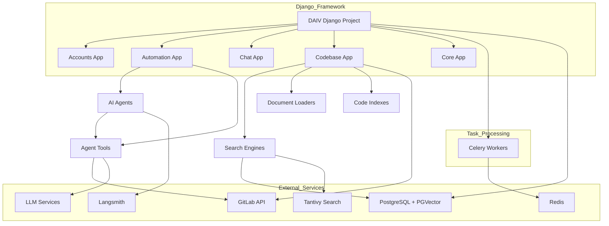
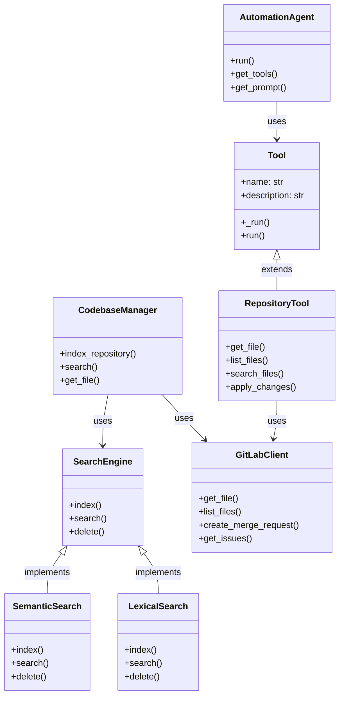
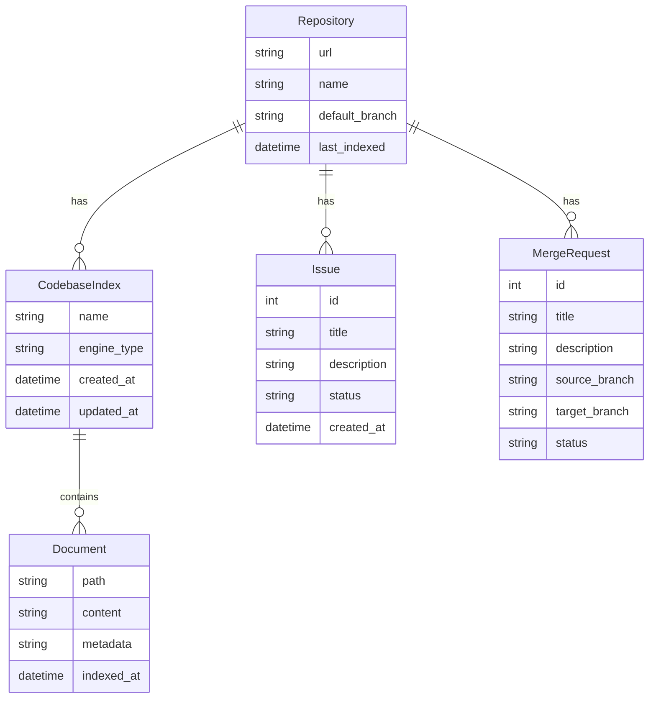
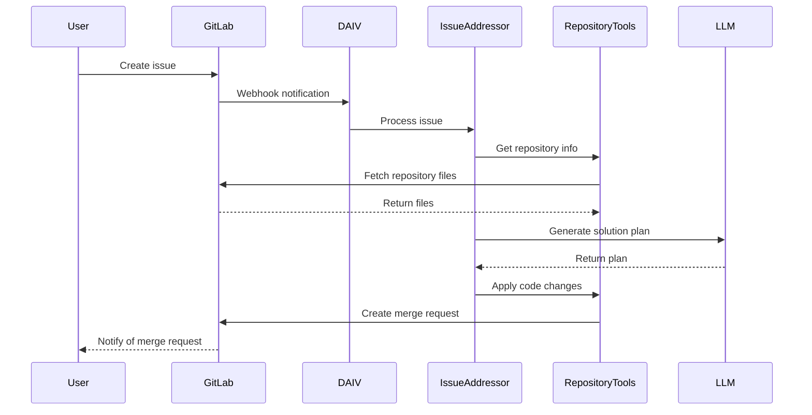
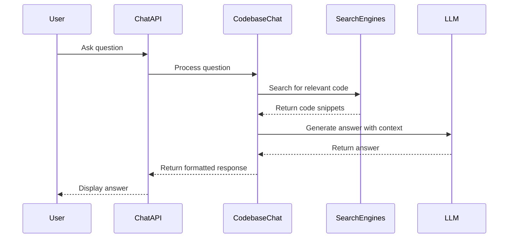
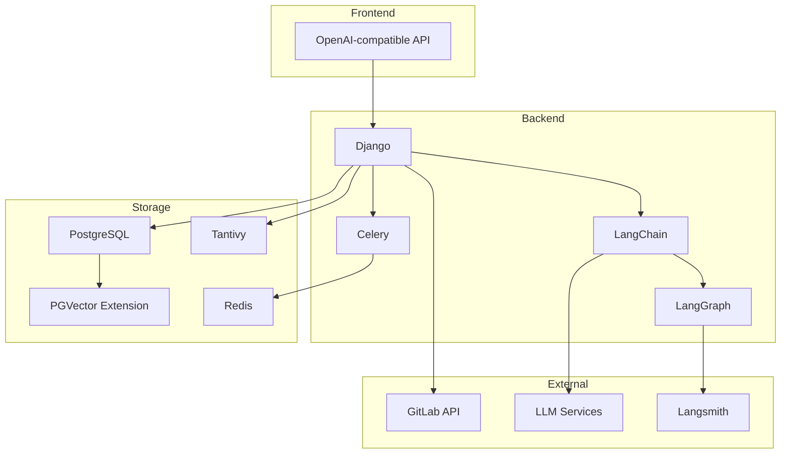

# DAIV Technical Architecture

## System Architecture

## Component Dependencies

## Data Models

## Key Workflows

### Issue Resolution Flow

### Codebase Chat Flow

## Technology Integration

